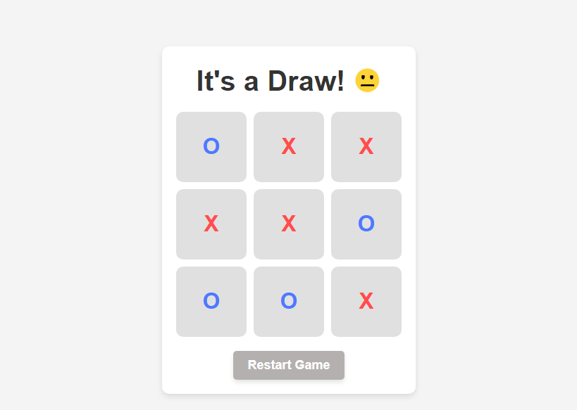

# XO Game

XO Game is a simple **Tic-Tac-Toe** browser game where two players take turns until one wins or the game ends in a draw.  
Built using **HTML, CSS, and JavaScript** only.

---

## Preview

  
*(Add a screenshot of your game here)*

---
## Live Demo

Try the game live here: [XO Game Live](https://mohamed-gaber53.github.io/XO-Game/)
---
## Features

- Simple and user-friendly interface.
- Supports two players: **X** and **O**.
- Automatic winner detection.
- Detects draw situations.
- Restart button to reset the game easily.
- Distinct colors for each player.

---

## How to Play

1. Open `index.html` in a modern browser.
2. Click on any empty cell to make a move.
3. Player **X** always starts first, then **O**.
4. The game ends when:
   - One player gets three in a row (horizontally, vertically, or diagonally), or
   - All cells are filled without a winner (draw).
5. Click **Restart Game** to play again.

---

## Project Structure

- **index.html**: The main HTML file containing the game layout.
- **style.css**: Styles for the grid, cells, colors, and layout.
- **script.js**: Game logic including player turns, winner detection, draw detection, and reset functionality.

---

## Technologies Used

- HTML5
- CSS3 (Flexbox & Grid)
- JavaScript (Vanilla JS)

---

## How to Run Locally

1. Download or clone the repository:
   ```bash
   git clone <repo-link>
2. Open index.html in your browser.

3. Start playing!
